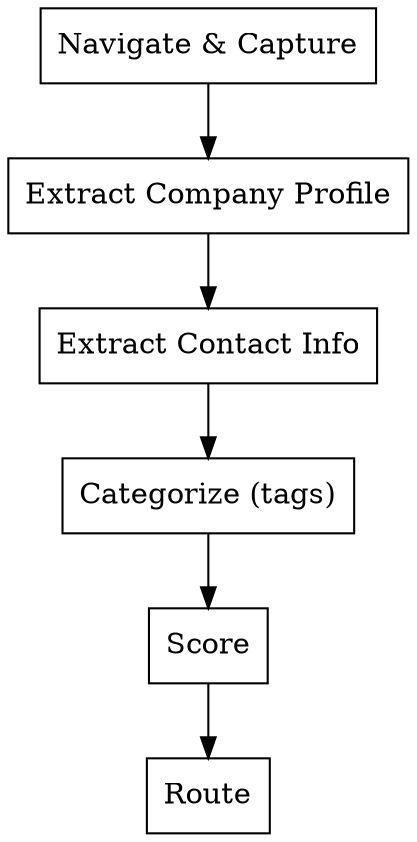

# Distributor Inspector (Orchestrator)

Inspect and score potential distributor websites for OrientStar Robotics (cleaning robot sales).

## Overview

This skill evaluates websites against ICP criteria, categorizes by niche market using standardized tags, and routes to appropriate action (prioritize/standard/explore/exclude/route-to-sales).

## Prerequisites

This skill uses **Playwright MCP** for website content extraction (pre-installed with Claude Code).

## When to Use

- Evaluating potential distributors from search results
- Qualifying websites for sales outreach
- Identifying competitor distributors (Pudu, Gausium, LionsBot, etc.)
- Categorizing companies by niche market

## Workflow



### Step 1: Navigate and Capture

Use Playwright MCP tools:
1. `browser_navigate` - load the website URL
2. Wait for page load + network idle
3. **Detect modal dialogs** - scan for cookie/consent popups using selectors:
   - `[data-testid="cookie-modal"]`, `.cookie-consent`, `#onetrust`, `.cookie-banner`
   - Buttons containing: "accept", "agree", "reject", "close", "ablehnen", "akzeptieren"
4. **If modal found**: Click "Accept All" (or best available option)
5. **Wait** for modal to close (max 2 seconds)
6. `browser_snapshot` - capture accessibility tree content

**Note:** If modal dismissal fails, proceed with snapshot and log exception in output.

### Step 2: Extract Company Profile

**Delegate to:** `references/company-profiler.md`

Extract: Products, Services, Brands, Geography, Team, SLA

### Step 3: Extract Contact Information

**Delegate to:** `references/contact-extractor.md`

Extract: Phone, Email, Address, WhatsApp, LinkedIn, Additional Channels

**Mandatory:** If LinkedIn not found on website, use google-search skill to search for it.

### Step 4: Categorize

**Delegate to:** `references/tags.md`

Apply niche market tags using format: `{primary-product-category}-{business-model}`

Multiple tags allowed. Special tags: `competitor-robot-distributor`, `pure-2c-retail`

### Step 5: Score

**Delegate to:** `references/scoring-rules.md`

| Component | Points |
|-----------|--------|
| Required: Sells as expected | PASS/FAIL |
| Bonus: Customer overlap | +0 to +50 |
| Bonus: Cleaning equipment | +30 to +90 |
| Bonus: Competitor footprint | +30 to +90 |
| Bonus: Channel capability | +0 to +20 |

> Total score capped at 100.

### Step 6: Route

| Grade | Score | Condition | Action |
|-------|-------|-----------|--------|
| A | 90+ | PASS gate | prioritize |
| B | 70-89 | PASS gate | standard |
| C | 50-69 | Any | explore |
| D/F | <50 | Any | exclude |
| — | — | Tier 1-2 competitor | route-to-sales |
| — | — | cleaning-services-provider | service-provider-prospect |
| — | — | hospitality-service-provider | route-to-ka |

**Special routing (overrides score):**
- Tagged `pure-2c-retail` with NO commercial products: `exclude`
- Tier 1-2 competitor footprint: `route-to-sales` + `competitive-conversion` play
- Tagged `cleaning-services-provider`: `service-provider-prospect`
- Tagged `hospitality-service-provider`: `route-to-ka`

## Output Format

```markdown
## {company_name} - {grade} ({score}/100)

**URL:** {url}
**Country:** {country} (detected from TLD/address/content)
**Language:** {language} (detected from content)
**Tags:** {tag1}, {tag2}
**Action:** {action}
**Play:** {play} (optional - only if competitor footprint detected)

### Company Profile
- **Products:** {products}
- **Services:** {services}
- **Brands:** {brands}
- **Geography:** {geography}
- **Team:** {team_presence}
- **SLA:** {sla_mentions}

### Contact
- **Phone:** {phone} or "Not found"
- **Email:** {email} or "Not found"
- **Headquarters:** {city}, {region}, {country} (or full address if single location)
- **Address:** {full_address} or "Not found"
- **Additional Locations:** {count} offices/branches (list if found) or "Single location"
- **WhatsApp:** {whatsapp_number} or "Not found"
- **Website:** {main_website} or "Same as URL"
- **LinkedIn:** {company_linkedin_url} or "Not found (searched)"
- **Additional Channels:** {youtube}, {twitter}, {facebook}, {instagram}, etc. or "None detected"

### Key Signals
{signals_list}

### Scoring Details

| Component | Result | Points |
|-----------|--------|--------|
| Sells as expected | {pass/fail with reason} | — |
| Customer overlap bonus | {level with evidence} | +{bonus} |
| Cleaning equipment bonus | {level with evidence} | +{bonus} |
| Competitor footprint bonus | {tier with evidence} | +{bonus} |
| Channel capability bonus | {signals detected} | +{bonus} |
| **Total** | (capped at 100) | **{total}** |

### Sales Play (if applicable)
{play_name}: {play_description}
```

**Special output formats:**
- `service-provider-prospect` - for cleaning service companies
- `route-to-ka` - for hotel chains / hospitality groups
- `exclude` - for pure-2c-retail with no commercial products

See full templates in original SKILL.md backup if needed.

## Error Handling

**Navigation Failure:** Return error with URL for manual review

**Empty Content:** Try scrolling page, then return error if still empty

**Modal Dismissal Failure:** Proceed with snapshot and add warning to output:
- `**Warning:** Cookie popup present - could not dismiss`
- `**Warning:** Modal dismissal timed out`

## Modal Handling

**Detection Selectors**:
- Cookie modals: `[data-testid="cookie-modal"]`, `.cookie-consent`, `#onetrust`, `.cookie-banner`
- Dismiss buttons: `button:has-text("Accept all")`, `button:has-text("Alle akzeptieren")`, `button:has-text("Tout accepter")`, `[aria-label="close"]`, `.close-btn`, `button:has-text("Agree")`

**Dismissal Priority**:
1. "Accept All" / "Alle akzeptieren" / "Tout accepter" (cleanest view)
2. "Reject" / "Ablehnen" / "Tout refuser"
3. Close button (X icon, `[aria-label="close"]`)
4. "Settings" (last resort, may not dismiss modal)

**Timeout**: 2 seconds per dismissal attempt
**Max Attempts**: 2 per page

**Exception Reporting** (add to output when applicable):
- `**Warning:** Cookie popup present - could not find dismiss button`
- `**Warning:** Modal dismissal timed out after 2s`

## Configuration Files

| File | Purpose |
|------|---------|
| `references/keywords.md` | Product/service keywords by industry |
| `references/tags.md` | Niche market tag taxonomy |
| `references/competing-brands.md` | Competitor brands to detect |
| `references/company-profiler.md` | Company profile extraction sub-skill |
| `references/contact-extractor.md` | Contact information extraction sub-skill |
| `references/scoring-rules.md` | Scoring rules and bonus calculations |

## Enrichment Workflow (Optional)

For high-value prospects or competitor distributors, use google-search skill:
- Claim Validation: `"{company} employees LinkedIn"`
- Market Coverage: `"{company} locations"`
- Competitor Relationship: `"{company} {competitor} partnership"`
