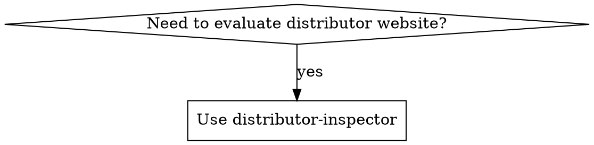

# Distributor Inspector

Inspect and score potential distributor websites for OrientStar Robotics (cleaning robot sales).

## Overview

Evaluates websites against ICP criteria, categorizes by niche market using standardized tags, and routes to appropriate action (prioritize/standard/explore/exclude/route-to-sales).

## Evidence Policy (Facts-Only)

**Hard rule:** Only include claims and scoring evidence that are explicitly supported by website content.

- If a capability is not explicitly stated, mark it as **Unknown** — do not infer.
- Do not write implied statements like "trained teams", "after-sales established", "customer base" unless the site explicitly states it.
- Indirect hints go in **Observations**, not capability claims or scoring.

## When to Use



**When to use:**
- Evaluating potential distributors from search results
- Qualifying websites for sales outreach
- Identifying competitor distributors (Pudu, Gausium, LionsBot, etc.)
- Categorizing companies by niche market

## Tag Format

`{primary-product-category}-{business-model}`

**Multiple tags allowed:** If a distributor sells cleaning robots specifically (e.g., "Reinigungsroboter", "robot de nettoyage", "robot pulitore"), apply both `cleaning-equipment-distributor` AND `robotics-distributor`.

**Product categories:** cleaning-equipment, cleaning-supplies, facility-management, cleaning-services, robotics, industrial-equipment, hospitality-supplies, general-merchandise

**Business models:** distributor, wholesaler, retailer, service-provider, system-integrator, manufacturer

**Special tags:** competitor-robot-distributor, pure-2c-retail

See `references/tags.md` for complete taxonomy.

## Scoring

| Component | Points |
|-----------|--------|
| Required: Sells as expected | PASS/FAIL |
| Bonus: Cleaning equipment | +30 to +90 |
| Bonus: Competitor footprint | +0 to +20 |
| Bonus: Channel capability | +0 to +20 |

> **Total score capped at 100.**

| Grade | Score | Action |
|-------|-------|--------|
| A | 90+ | prioritize |
| B | 70-89 | standard |
| C | 50-69 | explore |
| D/F | <50 | exclude |
| Tier 1-2 competitor footprint | — | route-to-sales + play |

**Competitor footprint triggers special routing:**
- If Tier 1-2 competitor evidence → Action: `route-to-sales`, Play: `competitive-conversion`
- If no/minimal competitor footprint → Action based on score above

## Output Format

**Markdown format** for human and AI readability:

```markdown
## {company_name} - {grade} ({score}/100)

**URL:** {url}
**Tags:** {tag1}, {tag2}
**Confidence:** {high|medium|low}
**Action:** {action}
**Play:** {play} (optional - only if competitor footprint detected)

### Company Profile
- **Products:** {products}
- **Services:** {services}
- **Brands:** {brands}
- **Geography:** {geography}
- **Team:** {team_presence}
- **SLA:** {sla_mentions}

### Verified Evidence (quotes/snippets)
- {verbatim or close paraphrase + page context}

### Observations (non-interpretive)
- {objective observation without capability inference}

### Scoring Breakdown

| Component | Points | Evidence |
|-----------|--------|----------|
| Required: Sells as expected | {PASS/FAIL} | {what they sell} |
| Cleaning equipment bonus | +{0-90} | {level}: {specific evidence from site} |
| Competitor footprint bonus | +{0-20} | {Tier X}: {competitor brand + evidence} |
| Channel capability bonus | +{0-20} | {count} signals: {specific signals found} |
| **Total** | **{score}** | (capped at 100) |

**Score calculation:**
- Base: {PASS = continue | FAIL = exclude}
- Cleaning equipment: {reasoning for level chosen}
- Competitor footprint: {reasoning for tier chosen}
- Channel capability: {list each signal with evidence}

### Sales Play (if applicable)
- Cite only explicitly verified evidence.
- Do not include assumptions like "trained teams" or "after-sales capability" unless the site explicitly states training/service/repair.
{play_name}: {play_description}
```

**For batch results**, compile into summary table:

```markdown
# Distributor Inspection Results

## Action Summary

| Action | Count | Companies |
|--------|-------|-----------|
| prioritize | X | {list} |
| standard | X | {list} |
| explore | X | {list} |
| route-to-sales | X | {list} |
| exclude | X | {list} |

## Top Prospects
{ranked_list_with_details}

## Competitor Distributors
{table_with_competitor_brands}
```

## Process

1. **Digest**: Fetch website, extract key info (company, products, services, brands, team, SLA)
2. **Categorize**: Apply niche market tags (multiple allowed)
3. **Score**: Run required checks + apply bonuses (cleaning equipment + competitor footprint + channel capability)
4. **Route**: Return action + play recommendation (if competitor footprint)

**Routing precedence:** Competitor footprint Tier 1–2 overrides score-based action.

## Cleaning Equipment Bonus

| Level | Evidence | Points |
|-------|----------|--------|
| Light | Mentions cleaning equipment, informational only | +30 |
| Moderate | Active in market: product catalog OR rental services OR Devis fulfillment | +50 |
| Strong | Core business: multiple products/rentals with pricing, established operations | +70 |
| Dominant | Primary business: extensive catalog/inventory, major distributor | +90 |

**Key insight:** Rental businesses are valid distributors. If they can survive renting/selling cleaning equipment, they can survive with cleaning robots.

## Competitor Footprint Bonus

| Tier | Evidence | Points | Example |
|------|----------|--------|---------|
| Tier 1 | Official distributor / Authorized partner language | +20 | "Official distributor of PUDU", "Authorized Gausium partner" |
| Tier 2 | Product pages / Sales evidence | +10 | Product listings, competitor SKU/model names from `references/competing-brands.md` |
| Tier 3 | Mentions only | +0 | Blog posts, comparisons, "compatible with..." |

**Why this is a bonus, not a blocker:** Competitor distributors are often high-value because they:
- Are already selling comparable products in the category (explicit competitor evidence)
- May already have channel motion for robots (distribution language, partner programs, pricing pages)
- Are typically open to multi-brand portfolios (if the site explicitly mentions multiple brands)

> Note: These are general patterns — do not claim capabilities about a specific company unless explicitly stated.

## Channel Capability Bonus (Facts-Only)

Award points **only** when the website explicitly shows these signals:

| Signal Type | Examples of Explicit Evidence |
|------------|-------------------------------|
| After-sales support | "Service", "Repair", "Spare parts", "Wartung", "Support center", "ticket system" |
| Demo / trial | "Demo", "Vorführung", "Teststellung", "Pilot", "free trial" |
| Multiple brands | Brand pages, logos, "We distribute X, Y, Z" |
| Multiple categories | Separate product categories (e.g., cleaning robots + reception robots + industrial robots) |
| SLA / response times | "SLA", "response within 24h", "Supportzeiten", "Service Level" |

**Scoring:**
- +5 = 1 explicit signal
- +10 = 2 explicit signals
- +20 = 3+ explicit signals **OR** explicit service/repair/training infrastructure page

**Not scored (record as Observation only):**
- Partner portal, warehouse/logistics, quiz — useful signals but not counted for points

## Competitor Detection

Check `references/competing-brands.md` for brands to detect:
- Pudu, Gausium, LionsBot, Tennant, Nilfisk, Kärcher, Adlatus, ICE Cobotics, SoftBank, Avidbots

**When competitor products found:**
1. Apply `competitor-robot-distributor` tag
2. Score competitor footprint tier (+0 to +20 bonus)
3. Route to sales with play label:

| Tier | Action | Play | Sales Approach |
|------|------|------|----------------|
| Tier 1 | route-to-sales | `competitive-conversion` | "You already know robot distribution. Here's why adding OrientStar grows your margin..." |
| Tier 2 | route-to-sales | `competitive-conversion` | "You're selling [competitor]. Here's what OrientStar does better for [specific use case]..." |
| Tier 3 | Score-based | — | Standard approach based on score |

## Configuration Files

| File | Purpose |
|------|---------|
| `references/keywords.md` | Product/service keywords by industry |
| `references/tags.md` | Niche market tag taxonomy |
| `references/competing-brands.md` | Competitor brands to detect |
