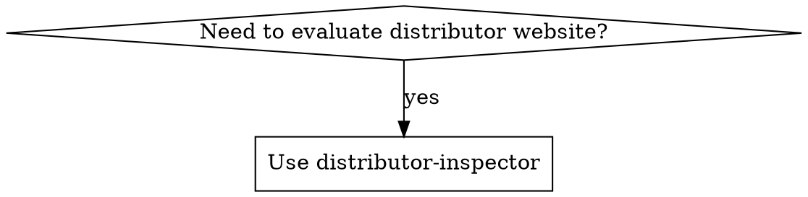

# Distributor Inspector

Inspect and score potential distributor websites for OrientStar Robotics (cleaning robot sales).

## Overview

Evaluates websites against ICP criteria, categorizes by niche market using standardized tags, and routes to appropriate action (prioritize/standard/explore/exclude/route-to-sales).

## Prerequisites

This skill uses **Playwright MCP** for website content extraction.

### Setup

Playwright MCP comes pre-installed with Claude Code. No additional setup required.

If you need to install it manually:

```bash
claude mcp add playwright npx @anthropic-ai/playwright-mcp
```

Then restart Claude Code.

## When to Use



**When to use:**
- Evaluating potential distributors from search results
- Qualifying websites for sales outreach
- Identifying competitor distributors (Pudu, Gausium, LionsBot, etc.)
- Categorizing companies by niche market

## Tag Format

`{primary-product-category}-{business-model}`

**Multiple tags allowed:** If a distributor sells cleaning robots specifically (e.g., "Reinigungsroboter", "robot de nettoyage", "robot pulitore"), apply both `cleaning-equipment-distributor` AND `robotics-distributor`.

**Product categories:** cleaning-equipment, cleaning-supplies, facility-management, cleaning-services, robotics, industrial-equipment, hospitality-supplies, general-merchandise

**Business models:** distributor, wholesaler, retailer, service-provider, system-integrator, manufacturer

**Special tags:** competitor-robot-distributor, pure-2c-retail

See `references/tags.md` for complete taxonomy.

## Scoring

| Component | Points |
|-----------|--------|
| Required: Sells as expected | PASS/FAIL |
| Bonus: Customer overlap | +0 to +50 |
| Bonus: Cleaning equipment | +30 to +90 |
| Bonus: Competitor footprint | +30 to +90 |
| Bonus: Channel capability | +0 to +20 |

> **Total score capped at 100.**

| Grade | Score | Condition | Action |
|-------|-------|-----------|--------|
| A | 90+ | PASS gate | prioritize |
| B | 70-89 | PASS gate | standard |
| C | 50-69 | Any | explore |
| D/F | <50 | Any | exclude |
| — | — | Tier 1-2 competitor | route-to-sales |
| — | — | cleaning-services-provider | service-provider-prospect |
| — | — | hospitality-service-provider | route-to-ka |
| — | — | pure-2c-retail ONLY | exclude |

**Special routing (overrides score):**
- Tagged `pure-2c-retail` with NO commercial products: `exclude` - B2C only, no ToB channels
- Tier 1-2 competitor footprint: `route-to-sales` + `competitive-conversion` play
- Tagged `cleaning-services-provider`: `service-provider-prospect`
- Tagged `hospitality-service-provider`: `route-to-ka`

**Note:**
- Companies tagged `pure-2c-retail` that ALSO sell commercial/industrial products should be scored normally
- Companies that FAIL the gate but score 50+ via customer overlap + channel capability route to `explore`

## Output Format

**Markdown format** for human and AI readability:

```markdown
## {company_name} - {grade} ({score}/100)

**URL:** {url}
**Tags:** {tag1}, {tag2}
**Action:** {action}
**Play:** {play} (optional - only if competitor footprint detected)

### Company Profile
- **Products:** {products}
- **Services:** {services}
- **Brands:** {brands}
- **Geography:** {geography}
- **Team:** {team_presence}
- **SLA:** {sla_mentions}

### Key Signals
{signals_list}

### Scoring Details

| Component | Result | Points |
|-----------|--------|--------|
| Sells as expected | {pass/fail with reason} | — |
| Customer overlap bonus | {level with evidence} | +{bonus} |
| Cleaning equipment bonus | {level with evidence} | +{bonus} |
| Competitor footprint bonus | {tier with evidence} | +{bonus} |
| Channel capability bonus | {signals detected} | +{bonus} |
| **Total** | (capped at 100) | **{total}** |

### Sales Play (if applicable)
{play_name}: {play_description}
```

**For service-provider-prospect (cleaning services):**

```markdown
## {company_name} - service-provider-prospect

**URL:** {url}
**Tags:** cleaning-services-provider
**Action:** service-provider-prospect

### Company Profile
- **Services:** {services}
- **Equipment used:** {equipment_brands_if_known}
- **Team:** {team_size}
- **Geography:** {geography}

### Note
This is a cleaning SERVICE provider, not an equipment distributor. They may be interested in:
- Purchasing robots for their own operations
- Becoming a referral partner
- Insights into local cleaning market
```

**For route-to-ka (hotel chains / Key Accounts):**

```markdown
## {company_name} - route-to-ka

**URL:** {url}
**Tags:** hospitality-service-provider
**Action:** route-to-ka

### Company Profile
- **Type:** Hotel chain / hospitality group
- **Locations:** {number_of_properties}
- **Geography:** {geography}

### Key Account Potential
This is a potential Key Account (end customer), not a distributor.

**Next step:** Use `KA-inspector` skill to evaluate as Key Account.
```

**For pure-2c-retail ONLY (no commercial products):**

```markdown
## {company_name} - exclude

**URL:** {url}
**Tags:** pure-2c-retail
**Action:** exclude

### Note
This is a B2C retailer selling only to consumers with no B2B distribution channels.

**Products observed:** {consumer_products}

**Exclusion reason:** No commercial/industrial products or B2B channels detected.

**Next step:** Do not pursue as distributor prospect.
```

**For pure-2c-retail WITH commercial products:**

Score and route normally based on commercial product lines. The `pure-2c-retail` tag is informational only.
```

**For batch results**, compile into summary table:

```markdown
# Distributor Inspection Results

## Action Summary

| Action | Count | Companies |
|--------|-------|-----------|
| prioritize | X | {list} |
| standard | X | {list} |
| explore | X | {list} |
| route-to-sales | X | {list} |
| service-provider-prospect | X | {list} |
| route-to-ka | X | {list} |
| exclude | X | {list} |

## Top Prospects
{ranked_list_with_details}

## Competitor Distributors
{table_with_competitor_brands}
```

## Process

Use Playwright MCP for website content extraction.

### Step 1: Navigate and Capture

Use Playwright MCP tools:
1. `browser_navigate` - load the website URL
2. `browser_snapshot` - capture accessibility tree content

### Step 2: Extract Company Profile

Parse the accessibility snapshot for:
- Company name
- Products and services
- Brands carried
- Team/employee indicators
- SLA/service mentions
- Geographic coverage

If navigation fails or snapshot is empty, return error with URL for manual review.

### Step 3: Categorize

Apply niche market tags from `references/tags.md` (multiple tags allowed).

### Step 4: Score

Check for commercial products first:
- If tagged `pure-2c-retail` AND NO commercial products detected → Skip scoring, route to `exclude`
- If tagged `pure-2c-retail` BUT has commercial products → Continue scoring (valid prospect)

Commercial product signals:
- Cleaning equipment (commercial scrubbers, sweepers, industrial vacuums)
- Facility management products
- Janitorial supplies
- Robotics/automation equipment
- Any B2B/wholesale product lines

Apply all bonuses (even if "sells as expected" fails):
- Required: Sells as expected (PASS/FAIL - informational)
- Bonus: Customer overlap (+0 to +50)
- Bonus: Cleaning equipment level (+30 to +90)
- Bonus: Competitor footprint tier (+30 to +90)
- Bonus: Channel capability signals (+0 to +20)

Total score capped at 100.

### Step 5: Route

Return action + play recommendation based on score:

| Score | Gate | Action |
|-------|------|--------|
| 90+ | PASS | `prioritize` |
| 70-89 | PASS | `standard` |
| 50-69 | Any | `explore` |
| <50 | Any | `exclude` |

**Special routing (overrides score):**
- Tier 1-2 competitor footprint: `route-to-sales` + `competitive-conversion` play
- Tagged `cleaning-services-provider`: `service-provider-prospect`
- Tagged `hospitality-service-provider`: `route-to-ka`

**Note:** Companies that FAIL the gate but score 50+ via customer overlap + channel capability route to `explore`.

## Error Handling

### Navigation Failure

If the website cannot be accessed:
1. Check the URL is correct and accessible
2. Verify the website is not blocking automated access
3. Return error with the URL for manual review

### Empty Content

If the accessibility snapshot is empty or missing key information:
1. Try scrolling the page with `browser_press_key` to load lazy content
2. Check if the page requires JavaScript interaction
3. Return error with URL for manual review

## Cleaning Equipment Bonus

| Level | Evidence | Points |
|-------|----------|--------|
| Light | Mentions cleaning equipment | +30 |
| Moderate | Has product category | +50 |
| Strong | Core offering, multiple products | +70 |
| Dominant | Primary business, extensive catalog | +90 |

## Competitor Footprint Bonus

| Tier | Evidence | Points | Example |
|------|----------|--------|---------|
| Tier 1 | Official distributor / Authorized partner language | +90 | "Official distributor of PUDU", "Authorized Gausium partner" |
| Tier 2 | Product pages / Sales evidence | +60 | Product listings, competitor SKU/model names from `references/competing-brands.md` |
| Tier 3 | Mentions only | +30 | Blog posts, comparisons, "compatible with..." |

**Why competitor footprint is a TOP signal:** Competitor distributors are the BEST prospects because they already have:
- Customer base in cleaning robotics
- Sales and deployment teams trained on robots
- After-sales service capability
- Market knowledge and relationships
- Proven willingness to invest in robot inventory

**This is MORE valuable than generic cleaning equipment sales** because the jump from cleaning equipment to robots is harder than switching robot brands.

## Channel Capability Bonus

Use bonus signals from `references/keywords.md`:

| Points | Evidence |
|--------|----------|
| +5 | 1 capability signal |
| +10 | 2 capability signals |
| +20 | 3+ signals OR explicit service/repair/spare parts/training page |

**Signals to detect:**
- **After-sales**: spare parts, maintenance, technical support, repair
- **Showroom/Demo**: showroom, demonstration, test drive, trial
- **Multiple brands**: "brands", "distributors of", "authorized dealer"
- **Multiple categories**: equipment + supplies + accessories
- **Clear SLA**: 24/48h response time, service guarantee

## Customer Overlap Bonus

Award points for serving target customers that OrientStar robots would clean. This bonus recognizes that distributors in adjacent industries (e.g., forklifts, material handling) may have valuable customer relationships and channel capabilities.

| Level | Evidence | Points |
|-------|----------|--------|
| None | No target customer mentions | +0 |
| Light | One target customer type mentioned | +20 |
| Moderate | 2+ types OR recurring focus | +35 |
| Strong | Core customer base is target sectors | +50 |

**Target customer categories:**
- **Warehouses/Logistics:** warehouse, logistics, distribution center, fulfillment, storage, depot
- **Factories/Industrial:** factory, manufacturing, industrial, production, plant
- **Property/FM:** property management, facility management, building services, real estate
- **Retail chains:** supermarket, retail chain, stores, multi-site

**Detection approach:**
- Look for customer testimonials, case studies, "our clients" sections
- Check service descriptions for target industries
- Identify mentions of warehouse/logistics/factory/retail customers

**Important:** This bonus applies regardless of whether "sells as expected" passes or fails. A forklift distributor serving warehouses can score 50+ through customer overlap + channel capability alone.

## Competitor Detection

Check `references/competing-brands.md` for brands to detect:
- Pudu, Gausium, LionsBot, Tennant, Nilfisk, Kärcher, Adlatus, ICE Cobotics, SoftBank, Avidbots

**When competitor products found:**
1. Apply `competitor-robot-distributor` tag
2. Score competitor footprint tier (+30 to +90 bonus)
3. Route to sales with play label:

| Tier | Bonus | Action | Play | Sales Approach |
|------|-------|--------|------|----------------|
| Tier 1 | +90 | route-to-sales | `competitive-conversion` | "You're already a robot distributor. Here's why adding OrientStar grows your margin and de-risks your supply chain..." |
| Tier 2 | +60 | route-to-sales | `competitive-conversion` | "You're selling [competitor]. Here's what OrientStar does better for [specific use case]..." |
| Tier 3 | +30 | route-to-sales or prioritize | `competitive-conversion` | "You mentioned [competitor]. Let's discuss how OrientStar complements or replaces that..." |

## Configuration Files

| File | Purpose |
|------|---------|
| `references/keywords.md` | Product/service keywords by industry |
| `references/tags.md` | Niche market tag taxonomy |
| `references/competing-brands.md` | Competitor brands to detect |

## Enrichment Workflow (Optional)

For deeper due diligence, use the **google-search** skill via the Skill tool.

### When to Enrich
- High-value prospects (Grade A)
- Competitor distributors (route-to-sales)
- Unclear company information on website

### How to Enrich

Use the Skill tool to invoke google-search:

```
Skill: google-search
Args: "{company} employees LinkedIn" + locale
```

**Enrichment searches:**
1. **Claim Validation:** `Skill: google-search "{company} employees LinkedIn"`
2. **Market Coverage:** `Skill: google-search "{company} locations"`
3. **Competitor Relationship:** `Skill: google-search "{company} {competitor} partnership"`

**Important:** Use the Skill tool, NOT built-in web search. The google-search skill uses Bright Data SERP API for localized, reliable results.

### Example Pipeline
Search (google-search skill) → Filter URLs → Inspect (this skill) → (optional) Enrich (google-search skill)

See CLAUDE.md for full multi-skill workflow examples.
