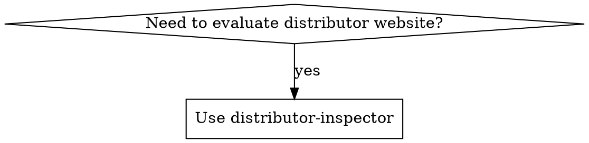

# Distributor Inspector

Inspect and score potential distributor websites for OrientStar Robotics (cleaning robot sales).

## Overview

Evaluates websites against ICP criteria, categorizes by niche market using standardized tags, and routes to appropriate action (prioritize/standard/explore/exclude/route-to-sales).

## When to Use



**When to use:**
- Evaluating potential distributors from search results
- Qualifying websites for sales outreach
- Identifying competitor distributors (Pudu, Gausium, LionsBot, etc.)
- Categorizing companies by niche market

## Tag Format

`{primary-product-category}-{business-model}`

**Product categories:** cleaning-equipment, cleaning-supplies, facility-management, cleaning-services, robotics, industrial-equipment, hospitality-supplies, general-merchandise

**Business models:** distributor, wholesaler, retailer, service-provider, system-integrator, manufacturer

**Special tags:** competitor-robot-distributor, pure-2c-retail

See `references/tags.md` for complete taxonomy.

## Scoring

| Component | Points |
|-----------|--------|
| Required: Sells as expected | PASS/FAIL |
| Bonus: Cleaning equipment | +30 to +90 |
| Bonus: Competitor footprint | +0 to +20 |
| Bonus: Channel capability | +0 to +20 |

> **Total score capped at 100.**

| Grade | Score | Action |
|-------|-------|--------|
| A | 90+ | prioritize |
| B | 70-89 | standard |
| C | 50-69 | explore |
| D/F | <50 | exclude |
| Tier 1-2 competitor footprint | — | route-to-sales + play |

**Competitor footprint triggers special routing:**
- If Tier 1-2 competitor evidence → Action: `route-to-sales`, Play: `competitive-conversion`
- If no/minimal competitor footprint → Action based on score above

## Output Format

**Markdown format** for human and AI readability:

```markdown
## {company_name} - {grade} ({score}/100)

**URL:** {url}
**Tags:** {tag1}, {tag2}
**Action:** {action}
**Play:** {play} (optional - only if competitor footprint detected)

### Company Profile
- **Products:** {products}
- **Services:** {services}
- **Brands:** {brands}
- **Geography:** {geography}
- **Team:** {team_presence}
- **SLA:** {sla_mentions}

### Key Signals
{signals_list}

### Scoring Details
- Sells as expected: {pass/fail}
- Cleaning equipment bonus: +{bonus}
- Competitor footprint bonus: +{bonus} (Tier X: {evidence})
- **Total score: {total}**

### Sales Play (if applicable)
{play_name}: {play_description}
```

**For batch results**, compile into summary table:

```markdown
# Distributor Inspection Results

## Action Summary

| Action | Count | Companies |
|--------|-------|-----------|
| prioritize | X | {list} |
| standard | X | {list} |
| explore | X | {list} |
| route-to-sales | X | {list} |
| exclude | X | {list} |

## Top Prospects
{ranked_list_with_details}

## Competitor Distributors
{table_with_competitor_brands}
```

## Process

1. **Digest**: Fetch website, extract key info (company, products, services, brands, team, SLA)
2. **Categorize**: Apply niche market tags (multiple allowed)
3. **Score**: Run required checks + apply bonuses (cleaning equipment + competitor footprint)
4. **Route**: Return action + play recommendation (if competitor footprint)

## Cleaning Equipment Bonus

| Level | Evidence | Points |
|-------|----------|--------|
| Light | Mentions cleaning equipment | +30 |
| Moderate | Has product category | +50 |
| Strong | Core offering, multiple products | +70 |
| Dominant | Primary business, extensive catalog | +90 |

## Competitor Footprint Bonus

| Tier | Evidence | Points | Example |
|------|----------|--------|---------|
| Tier 1 | Official distributor / Authorized partner language | +20 | "Official distributor of PUDU", "Authorized Gausium partner" |
| Tier 2 | Product pages / Sales evidence | +10 | Product listings, "we sell PUDU models", pricing pages |
| Tier 3 | Mentions only | +0 | Blog posts, comparisons, "compatible with..." |

**Why this is a bonus, not a blocker:** Competitor distributors already have:
- Customer base in cleaning robotics
- Sales and deployment teams trained on robots
- After-sales service capability
- Market knowledge and relationships

These are high-value prospects for competitive conversion.

## Channel Capability Bonus

Use bonus signals from `references/keywords.md`:

| Points | Evidence |
|--------|----------|
| +5 | 1 capability signal |
| +10 | 2 capability signals |
| +20 | 3+ signals OR explicit service/repair/spare parts/training page |

**Signals to detect:**
- **After-sales**: spare parts, maintenance, technical support, repair
- **Showroom/Demo**: showroom, demonstration, test drive, trial
- **Multiple brands**: "brands", "distributors of", "authorized dealer"
- **Multiple categories**: equipment + supplies + accessories
- **Clear SLA**: 24/48h response time, service guarantee

## Competitor Detection

Check `references/competing-brands.md` for brands to detect:
- Pudu, Gausium, LionsBot, Tennant, Nilfisk, Kärcher, Adlatus, ICE Cobotics, SoftBank, Avidbots

**When competitor products found:**
1. Apply `competitor-robot-distributor` tag
2. Score competitor footprint tier (+0 to +20 bonus)
3. Route to sales with play label:

| Tier | Action | Play | Sales Approach |
|------|------|------|----------------|
| Tier 1 | route-to-sales | `competitive-conversion` | "You already know robot distribution. Here's why adding OrientStar grows your margin..." |
| Tier 2 | route-to-sales | `competitive-conversion` | "You're selling [competitor]. Here's what OrientStar does better for [specific use case]..." |
| Tier 3 | Score-based | — | Standard approach based on score |

## Configuration Files

| File | Purpose |
|------|---------|
| `references/keywords.md` | Product/service keywords by industry |
| `references/tags.md` | Niche market tag taxonomy |
| `references/competing-brands.md` | Competitor brands to detect |
