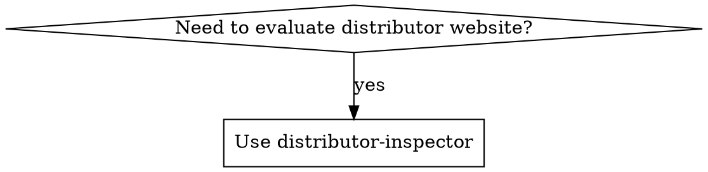

# Distributor Inspector

Inspect and score potential distributor websites for OrientStar Robotics (cleaning robot sales).

## Overview

Evaluates websites against ICP criteria, categorizes by niche market using standardized tags, and routes to appropriate action (prioritize/standard/explore/exclude/route-to-sales).

## When to Use



**When to use:**
- Evaluating potential distributors from search results
- Qualifying websites for sales outreach
- Identifying competitor distributors (Pudu, Gausium, LionsBot, etc.)
- Categorizing companies by niche market

## Tag Format

`{primary-product-category}-{business-model}`

**Product categories:** cleaning-equipment, cleaning-supplies, facility-management, cleaning-services, robotics, industrial-equipment, hospitality-supplies, general-merchandise

**Business models:** distributor, wholesaler, retailer, service-provider, system-integrator, manufacturer

**Special tags:** competitor-robot-distributor, pure-2c-retail

See `config/tags.md` for complete taxonomy.

## Scoring

| Component | Points |
|-----------|--------|
| Required: Sells as expected | PASS/FAIL |
| Required: No competitor focus | PASS/FAIL |
| Bonus: Cleaning equipment | +30 to +90 |

| Grade | Score | Action |
|-------|-------|--------|
| A | 90+ | prioritize |
| B | 70-89 | standard |
| C | 50-69 | explore |
| D/F | <50 | exclude |
| (any) + competitor tag | — | route-to-sales |

## Output Format

**Markdown format** for human and AI readability:

```markdown
## {company_name} - {grade} ({score}/100)

**URL:** {url}
**Tags:** {tag1}, {tag2}
**Action:** {action}

### Company Profile
- **Products:** {products}
- **Services:** {services}
- **Brands:** {brands}
- **Geography:** {geography}
- **Team:** {team_presence}
- **SLA:** {sla_mentions}

### Key Signals
{signals_list}

### Scoring Details
- Sells as expected: {pass/fail}
- No competitor focus: {pass/fail}
- Cleaning equipment bonus: +{bonus}
- Total score: {total}
```

**For batch results**, compile into summary table:

```markdown
# Distributor Inspection Results

## Action Summary

| Action | Count | Companies |
|--------|-------|-----------|
| prioritize | X | {list} |
| standard | X | {list} |
| explore | X | {list} |
| route-to-sales | X | {list} |
| exclude | X | {list} |

## Top Prospects
{ranked_list_with_details}

## Competitor Distributors
{table_with_competitor_brands}
```

## Process

1. **Digest**: Fetch website, extract key info (company, products, services, brands, team, SLA)
2. **Categorize**: Apply niche market tags (multiple allowed)
3. **Score**: Run required checks + apply cleaning equipment bonus
4. **Route**: Return action recommendation

## Cleaning Equipment Bonus

| Level | Evidence | Points |
|-------|----------|--------|
| Light | Mentions cleaning equipment | +30 |
| Moderate | Has product category | +50 |
| Strong | Core offering, multiple products | +70 |
| Dominant | Primary business, extensive catalog | +90 |

## Competitor Detection

Check `human_input/competing brands & SKUs.md` for brands to detect:
- Pudu, Gausium, LionsBot, Tennant, Nilfisk, Kärcher, Adlatus, ICE Cobotics, SoftBank, Avidbots

If competitor products found → apply `competitor-robot-distributor` tag → action: `route-to-sales`

## Configuration Files

| File | Purpose |
|------|---------|
| `config/keywords.md` | Product/service keywords by industry |
| `config/tags.md` | Niche market tag taxonomy |
| `human_input/competing brands & SKUs.md` | Competitor brands to detect |
